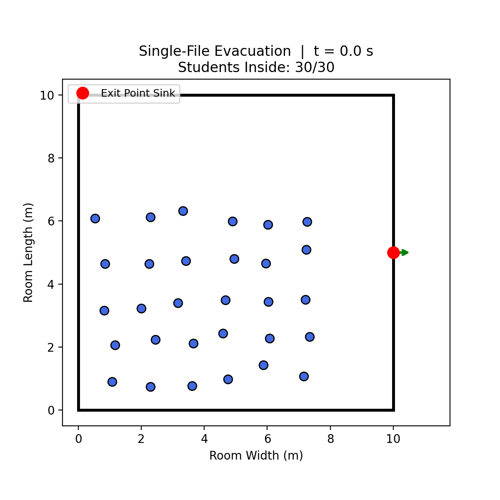

# Classroom Evacuation Dynamics: An Agent-Based Simulation

A 2D Agent-Based Model (ABM) built in Python to analyze pedestrian congestion patterns, bottleneck phase transitions, and evacuation efficiencies under competitive vs. controlled exit dynamics. Developed as the final project for MAT 180.



## 🚀 Key Findings & Insights
* **The "Faster is Slower" Paradox:** Proved mathematically and visually that panicking and pushing beyond an optimal walking speed ($0.89\text{ m/s}$ to $1.3\text{ m/s}$) increases lateral friction at the door, *slowing down* total room evacuation[cite: 1, 2].
* **Crowd Density Phase Transition:** Identified a critical capacity threshold ($\rho_c = 0.2\text{ students/m}^2$) where flow transitions smoothly from free-flowing to heavy congestion[cite: 1].
* **Semicircular Arching:** Documented high kinetic pressure zones forming semicircular arcs around bottlenecks, highlighting structural safety risks[cite: 1].

## 🛠️ Tech Stack & Concepts
* **Language:** Python
* **Libraries:** NumPy, Matplotlib, IPython
* **Mathematical Modeling:** Systems of First-Order Ordinary Differential Equations (ODEs), Hyperbolic Tangent Optimal Velocity Functions, Anisotropic Vision Cones, and Isotropic Personal-Space Repulsion Forces[cite: 1].

## ⚙️ Getting Started & Replication
1. Clone the repository:
   ```bash
   git clone [https://github.com/your-username/classroom-evacuation-sim.git](https://github.com/your-username/classroom-evacuation-sim.git)
   cd classroom-evacuation-sim